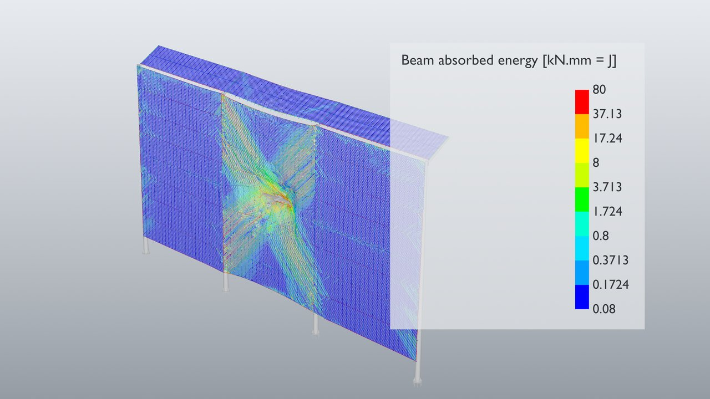
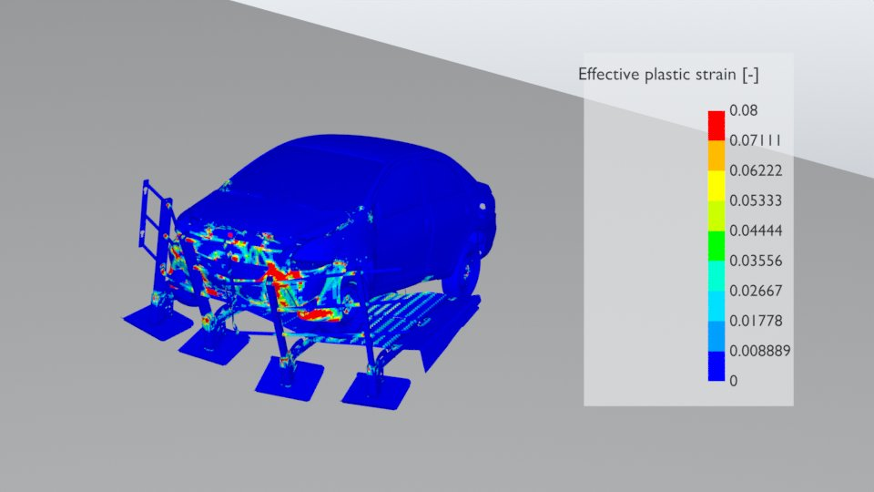
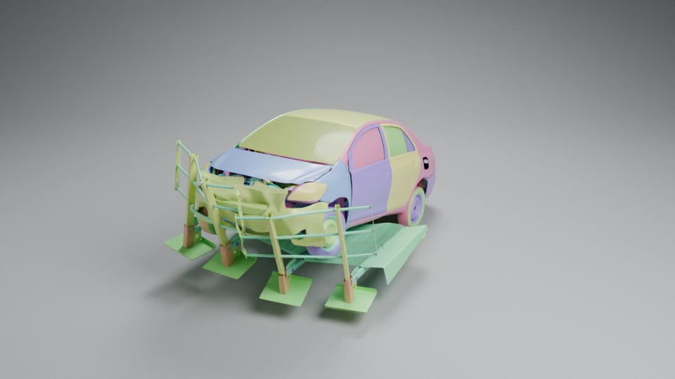
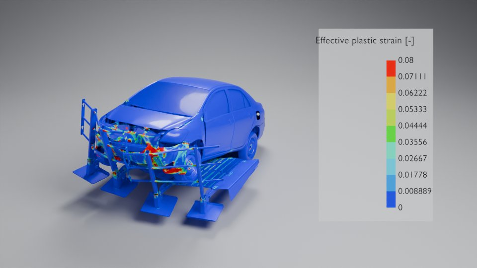
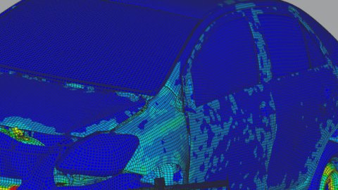

# dyna2usd

LS-DYNA `d3plot` results → animated **OpenUSD** → **Blender** studio / photoreal / FE renders.

A small library of tools to turn crash & impact simulations into render-ready scenes:
exact geometry, per-part grouping, per-vertex deformation over time, element erosion,
beams and SPH, result fields (stress, plastic strain, displacement, beam forces and
absorbed energy) — then a Blender toolbox to light, shade and render them.



| | |
|---|---|
|  |  |
| FE look — effective plastic strain | Studio look — satin part colours, cyclorama |
|  |  |
| Studio `--color-by plastic_strain` | FE look with element lines (1080p crop) |

## Status

| Piece | State |
|-------|-------|
| `converter/d3plot_to_usd_lasso.py` — d3plot → animated USD + result fields | **working** |
| `blender/dyna_import.py` — import + beam radius setup | **working** |
| `blender/look.py` — look creator: `studio`, `fe` (LS-PrePost style) | **working** |
| `blender/field.py` — switchable result field (geometry nodes) | **working** |
| `blender/wire_energy.py` — wire energy proxy (strain / velocity) | **working** |
| Material library by part rules, camera rigs, batch render | planned — see `PROJECT.md` |

## Converter

Requires Python 3.11 with `lasso-python` (open-lasso-python), `usd-core` (`pxr`) and `numpy`.

```bat
pip install lasso-python usd-core numpy

:: full model, all states
py -3.11 converter\d3plot_to_usd_lasso.py <path\d3plot> -o crash.usdc

:: with result fields for colour-by-result renders
py -3.11 converter\d3plot_to_usd_lasso.py <path\d3plot> -o crash.usdc --fields von_mises,plastic_strain,displacement,axial_force,axial_work

:: smoke test: states 1-6, only parts matching 2000*, without the barrier
py -3.11 converter\d3plot_to_usd_lasso.py <path\d3plot> -o t.usdc --states 1:6 --parts "2000*" --exclude "HS*"

:: full-restart chain merged on one timeline
py -3.11 converter\d3plot_to_usd_lasso.py run\d3plot restart\d3plot -o full.usdc

:: self-check (no args)
py -3.11 converter\d3plot_to_usd_lasso.py
```

- **Fields** (`--fields`): shells/solids `von_mises`, `plastic_strain` (per face, max over
  integration points); `displacement` (per vertex); beams `von_mises`, `plastic_strain`,
  `axial_force`, `axial_work` (per wire node; `axial_work` = real absorbed energy,
  cumulative F·dL). Fields cost file size (each beam field ≈ 0.3 GB on 1.5M beams):
  export the ones you render.
- **Beams** are joined into continuous polylines on shared nodes (1.56M beams → 10k
  curves); eroded segments split them per frame.
- **Solids** export exterior faces only; meshes are tagged `subdivisionScheme = none`.

Full conversion doc (output layout, erosion, beams, SPH, restarts, fields):
[`converter/README.md`](converter/README.md).

## Blender (5.1+)

### Import

```bat
blender --python blender\dyna_import.py -- crash.usdc [radius_mm]
```

Imports the stage (frame range from the file) and sets up the beams:

- **Dyna Beam** modifier — `Radius` (mm) drives the curve radius. Native curves render
  as round tubes in Cycles and EEVEE at zero triangle cost. Change all beams at once:
  select them, Alt+Enter on Radius.
- **Curve to Tube** (Blender's built-in essentials modifier, Scale = Radius) — off by
  default; enable it for real tube geometry (caps, UVs, custom profile).
- Scene curve display set so radius shows everywhere: EEVEE/viewport `Strip`
  (Blender's default `Strand` draws fixed thin lines and ignores radius), Cycles
  `3D Curves`.
- Result fields arrive as attributes (face or point domain).
- Motion blur works out of the box in Cycles (Blender samples the USD between frames).

### Looks

```bat
:: FE post-processor look: banded JET9 fringe, legend, grey rigid parts, element lines
blender -b --python blender\look.py -- --usd crash.usdc --look fe --field von_mises --out crash_fe.blend --render fe.png

:: photoreal studio: cyclorama, 3 area lights, satin part colours, metal rigid parts/beams
blender -b --python blender\look.py -- --usd crash.usdc --look studio --out crash_studio.blend --render studio.png

:: studio coloured by a result, with legend
blender -b --python blender\look.py -- --usd crash.usdc --look studio --color-by plastic_strain --render eps.png

:: wire energy, 4K (the image at the top)
blender -b --python blender\look.py -- --usd wiremesh.usdc --look fe --field axial_work --radius 15 --fit frame --res 3840 2160 --render energy.png

:: or apply a look to an already-imported .blend
blender -b crash.blend --python blender\look.py -- --look fe --field plastic_strain --out crash_fe.blend
```

Data-driven: rigid parts (edge lengths never change) render grey, the camera frames
the deforming parts, the legend max is the 99.5th percentile over the animation rounded
to a clean number, element lines switch on only when elements are ≥ 4 px.

Useful options: `--view iso|iso2|+x|-x|+y|-y|top`, `--fit all|frame` (whole animation vs
the rendered frame only), `--legend-max`, `--legend-pct`, `--scale auto|linear|log`,
`--title`, `--lines auto|on|off`, `--res`, `--samples`, `--engine cycles|eevee`,
`--radius` (beam mm). `--help` lists all. New looks: write `build_<name>(ctx, args)` and
add it to `LOOKS`.

### Switching the result field

Looks colour through a **Dyna Field** geometry-nodes modifier (`blender/field.py`): a menu
picks the field, Min/Max (and Log) normalise it into `fe_value`, which the materials read.
Every modifier is driven by scene props, so one change switches the whole model:

- Properties › Scene › Custom Properties: `fe_field` (0 von_mises, 1 plastic_strain,
  2 displacement, 3 axial_force, 4 axial_work), `fe_min`, `fe_max`, `fe_log`.
- Or, to also recompute the range and relabel the legend, in the Python console:
  `import field; field.set_field(C.scene, "plastic_strain")`

`axial_work` defaults to a 3-decade log legend: beam energy is heavy-tailed (median 0.01,
max 2.7e5 on the wiremesh), a linear legend shows it all blue. `axial_force` gets a
symmetric legend centred on green.

### Wire energy proxy

`blender/wire_energy.py --mode strain|velocity` colours wires by a geometry-only estimate
(plastic stretch or peak node speed, max-held in a simulation zone) when the model was
converted without beam results. With `--fields axial_work`, prefer the real energy.

### Playback

Use the Vulkan backend (Preferences → System → Backend): measured +25–70 % viewport fps
on deforming crash meshes. The limit is Blender redrawing deforming meshes, not USD —
see the benchmarks in `PROJECT.md`.

## Layout

```
converter/   d3plot → animated USD (the core) + its README
blender/     dyna_import.py · look.py · field.py · wire_energy.py
docs/img/    gallery renders
data/        local test results & outputs (not versioned)
PROJECT.md   goal, decisions, benchmarks, roadmap
```

Every script self-checks with no arguments (`py -3.11 converter\...`,
`blender -b --factory-startup --python blender\<script>.py`).

## License

MIT — see `LICENSE`.
